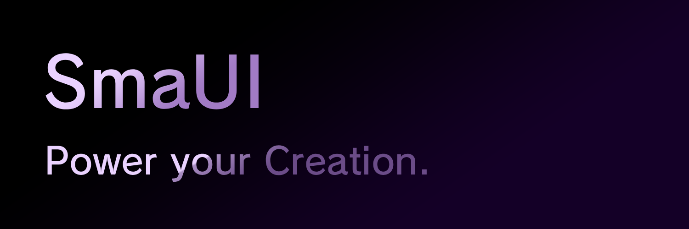
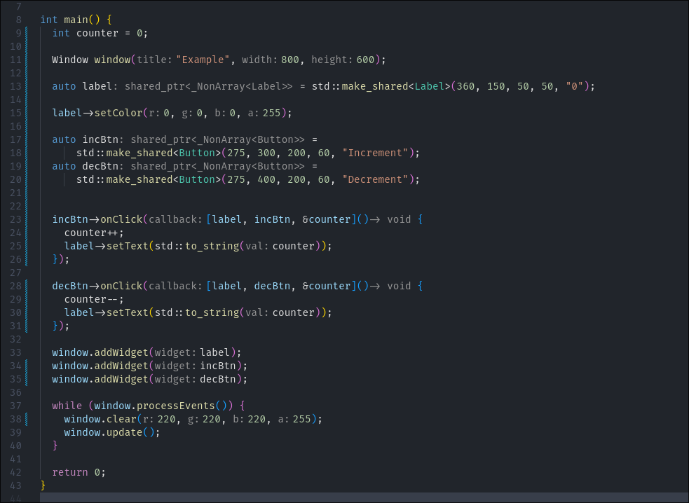
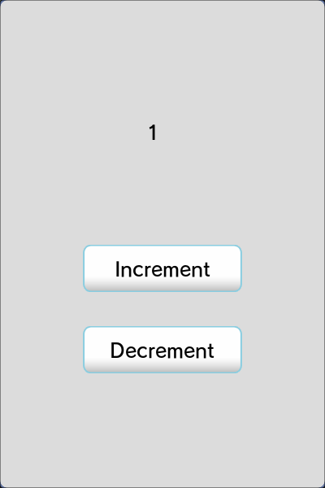

# SmaUI
A cross-platform C++ desktop framework powered by SDL2.
Minimal. Performant. Fun.



SmaUI uses the power of SDL2 and C++ to help developers create blazing-fast desktop apps for Windows, Linux, and macOS. Currently in Beta 1.0, SmaUI already includes powerful core widgets and a familiar syntax inspired by Tkinter and wxWidgets—but with real performance.

Ideal for:
✅ Prototyping GUIs in C++
✅ Learning how GUIs work under the hood
✅ Building lightning-fast native apps
<hr>

## 🧪 Quick Example: A Minimal Counter App



Simplicity, performance, and clarity—all in just a few lines.

🎨 Styles Included

SmaUI supports stylesheets using folders of PNG assets. A default style is included for prototyping. You can also load your own via:

```C++
Style* buttonStyle = loadStyle(renderer, "tools/creative/ui/button");
```

# 🔧 Setup

Requires:
    SDL2
    SDL2_ttf
    SDL2_image

Tested on Linux. Works on Windows and MacOS.

Run:
```bash
git clone https://github.com/MarkDemidovs/Smaui.git
cd smaui
make
./builds/app
```

You should see the basic counter app.



See main.cpp and tools/tests/ for more examples!
## 📦 Widgets Available

    ✅ Window

    ✅ Label

    ✅ Button (with hover/pressed effects)

    ✅ Panel (for grouping widgets)

    ✅ Textbox (text input, single-line)

Each widget is imported from:
```C++
#include "./tools/widgets/WIDGET_NAME/WIDGET_NAME.h"
```

## 🚧 Roadmap — Beta 1.0 and Beyond

✔ = Complete   ✎ = In Progress   ☐ = Planned

### Feature	Status 

Basic Window	✔

Label	✔

Button	✔

Panel	✔

Textbox (Single-line)	✔

Checkbox	✎

Radio Button Group	☐

Slider	☐

Scrollbar	☐

Tooltip	☐

Image / Icon Widget	☐

Dropdown / Combo Box	☐

Multiline Textbox	☐

List View	☐

Tab Control	☐

Progress Bar	☐

Menu Bar	☐

Modal / Popup Dialog	☐

Tree View	☐

Table View	☐

Canvas / Custom Draw Widget	☐

Split Pane / Resizable Panels	☐

Animations & Transitions	☐

Keyboard Navigation	☐

Accessibility	☐

High DPI Support	☐

Full Window Controls	☐

Custom Title Bars & Borders	☐

Multi-Window Support	☐

Transparency / Layering	☐

Snap / Dock Support	☐

Runtime Theming / Skin Switching	☐

Persistent Window State	☐

Multi-Monitor & DPI Awareness	☐

OpenGL Rendering Support	☐

Custom Style Language	☐

HTML ☐


## 💬 Questions or Issues?

Open an issue here on GitHub, or contact me:

📨 Twitter / X: @markdemidovs
⭐️ Thanks for Visiting!

We’re just getting started—get involved, fork the project, or just build something cool with SmaUI.